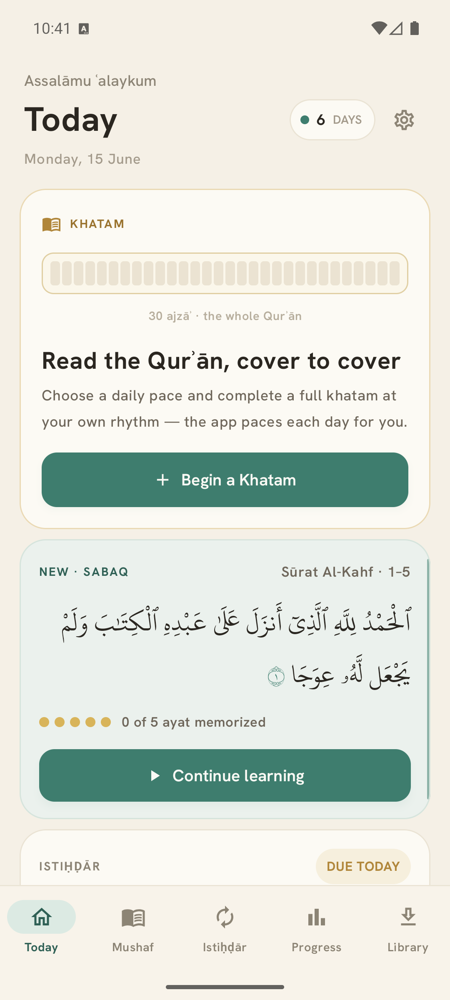
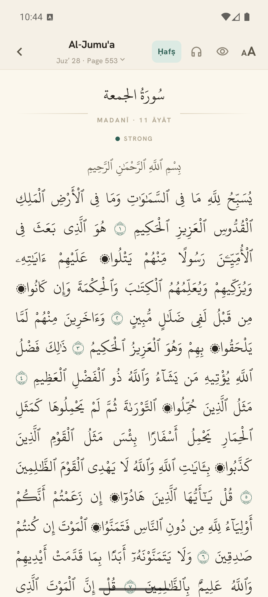
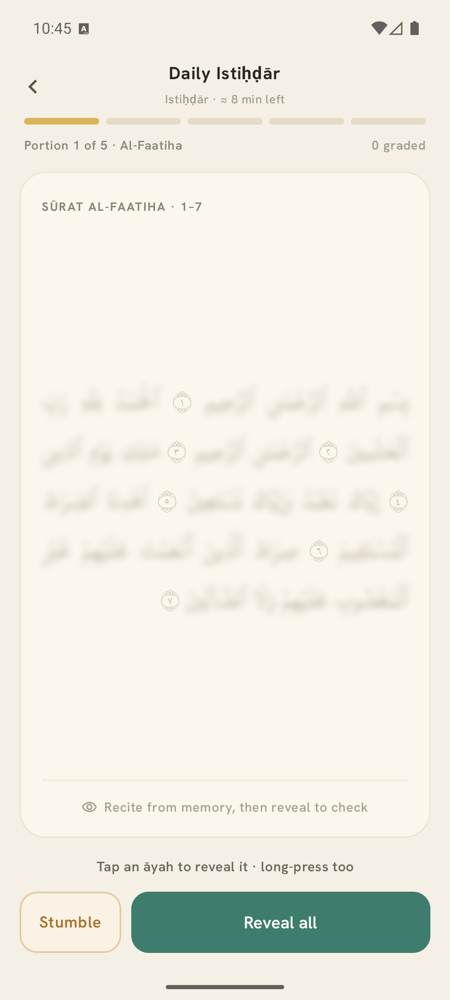
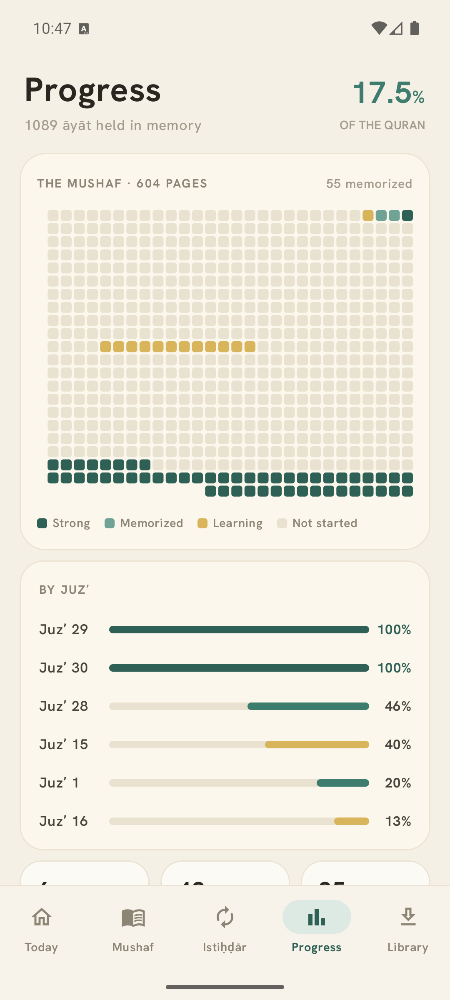
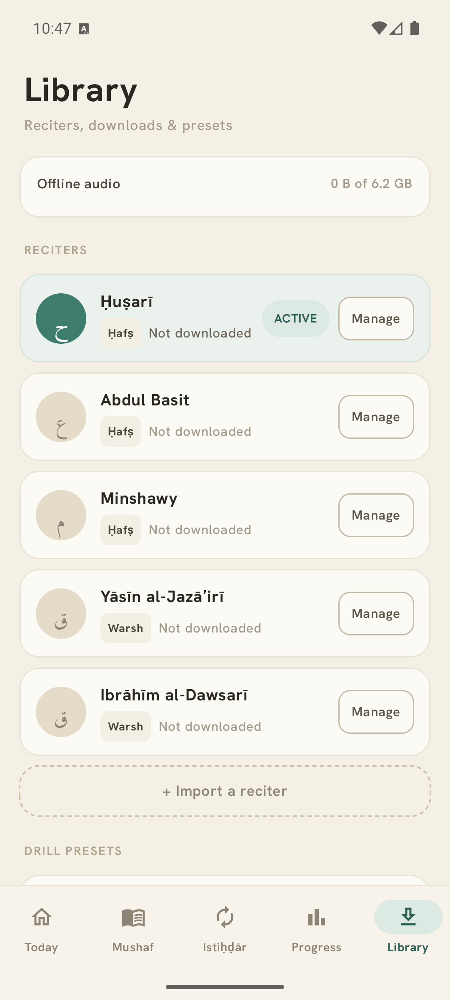

# Alkahf · الكهف

**An offline-first Android app for memorising the Qurʾān (ḥifẓ).**

Alkahf brings the muṣḥaf, your daily lesson (*sabaq*), spaced-repetition review
(*istiḥḍār*), audio drills, and full-Qurʾān recitation tracking (*khatam*) into a
single, calm, fully offline app. There is no account and no network requirement —
everything lives on your device.

---

## Screenshots

<table>
  <tr>
    <td align="center"><br><sub><b>Today</b></sub></td>
    <td align="center"><br><sub><b>Mushaf</b></sub></td>
    <td align="center"><br><sub><b>Istiḥḍār</b></sub></td>
    <td align="center"><br><sub><b>Progress</b></sub></td>
    <td align="center"><br><sub><b>Library</b></sub></td>
  </tr>
</table>

---

## Features

### 📖 Mushaf
- Page-accurate Uthmanic muṣḥaf (604 pages) in the **KFGQPC** script and fonts.
- Two readings (*riwāyāt*): **Ḥafṣ** and **Warsh**, each with its own text, font,
  pagination, and reciters.
- **Hide & self-test** mode — recall an āyah from memory, then reveal it word by
  word (tap) or in full (long-press).
- Per-āyah audio: tap any āyah to listen, or play a range.
- Tap a sūrah’s name to **set it as your sabaq**, mark its whole memorization
  state, or listen to it.
- Select an āyah range — **including ranges that span page boundaries** — to mark,
  set as sabaq, or play.

### 🌱 Sabaq (daily lesson)
- Track the new portion you’re learning today.
- The sabaq advances **only when you explicitly mark it done** — and only once
  every āyah in it is *Memorized* or *Strong*.

### 🔁 Istiḥḍār (spaced review)
- An SM-2 spaced-repetition schedule surfaces exactly the portions due today.
- Configurable pacing (gentle / standard / aggressive) and a daily time budget.
- Recall from memory, reveal to check, and mark stumbles to lower the grade.

### 🎧 Drills
- A loop player with cumulative chaining, per-āyah repeats, recite-back gaps, and
  adjustable speed — built for drilling a passage into memory.

### 🕋 Khatam (cover-to-cover recitation)
- Program a full Qurʾān recitation at a daily pace (1–3 ajzāʾ/day); the finish
  date is derived for you.
- A tracker with a progress ring, a 30-juzʼ map, today’s portion, and a completion
  log — plus an optional **daily reminder** of today’s portion.

### 📊 Progress
- A 604-page memorization map and per-juzʼ bars across four states —
  *Not started · Learning · Memorized · Strong*.
- Streaks, a weekly summary, and how much of the Qurʾān you’re holding in memory.

### 🗣️ Reciters & audio
- Download per-āyah audio from [everyayah.com](https://everyayah.com), cached on
  device.
- Import your own reciter and align it to the muṣḥaf with **Tawqīt** per-āyah
  timing.

### ⚙️ Throughout
- Bilingual UI — **English and Arabic** (full RTL).
- Light and dark themes.
- Daily ḥifẓ reminders.
- 100% offline · no account · all data stays on the device.

---

## Build & run

Requires Android Studio (or the Android SDK + JDK 17) and a device/emulator on
**Android 8.0 (API 26)** or newer.

```bash
./gradlew assembleDebug     # debug APK -> app/build/outputs/apk/debug/
./gradlew installDebug      # build + install on a connected device/emulator
./gradlew lint              # Android lint
```

There are no unit or instrumentation tests; changes are verified by building and
running on a device/emulator.

---

## Architecture

A single-module app (`app`, package `app.alkahf`), **Kotlin + Jetpack Compose +
Material 3**, minSdk 26 / compile+target SDK 35, **Room via KSP**.

- **`MainActivity`** hosts the Compose content; **`ui/AlkahfApp.kt`** is the root
  composable and routes between screens with a sealed `Screen` back stack (no
  Navigation library).
- **`data/QuranRepository.kt`** is a thin facade over focused stores — Qurʾān text,
  sabaq, drills, review, reciters, audio, khatam, and settings.
- **`data/quran/`** holds the read-only bundled Qurʾān databases
  (`quran.db` = Ḥafṣ, `quran_warsh.db` = Warsh); **`data/user/`** holds the
  writable `user.db` (memorization, review schedule, drills, reciters, khatam),
  versioned with Room migrations.
- Each screen is driven by its own `StateFlow`-backed controller.
- Colours come from the `AlkahfColors` token palette; user-facing strings live in
  `res/values/strings.xml` with an Arabic translation in `res/values-ar/`.

---

## Credits & attribution

- **Qurʾān text and the Uthmanic fonts** are from the King Fahd Glorious Qurʾān
  Printing Complex (**KFGQPC**) and remain its property, used under its terms.
- **Recitation audio** is served by [everyayah.com](https://everyayah.com) and
  belongs to the respective reciters.

The bundled `quran.db` / `quran_warsh.db` assets are the source of truth for the
Qurʾānic text.
